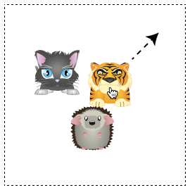
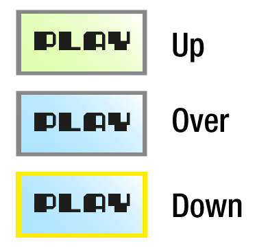
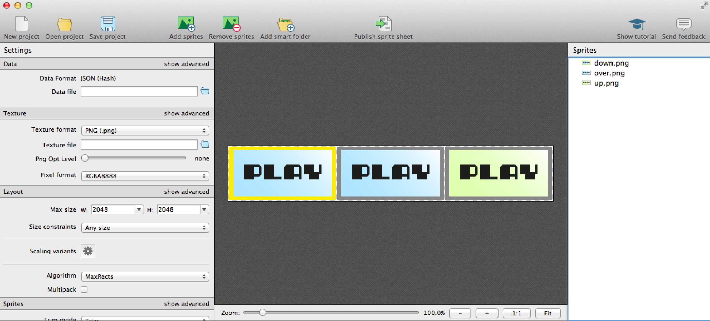
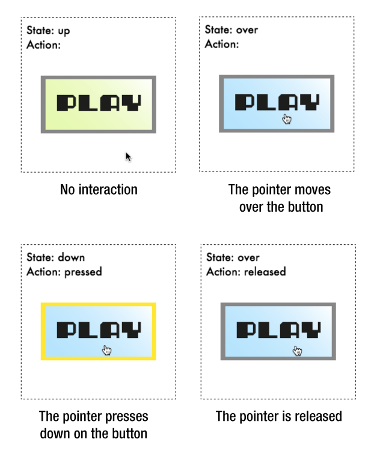

Tink - Interactivity utilities for Pixi
=======================================

Tink is an easy-to-use set of interactivity tools for the Pixi
rendering engine. You can use Tink to easily create:

- Drag and drop objects.
- Click-able, touch-able buttons with customizable actions.
- A universal pointer object that works for both touch and and the
  mouse.
- Interactive sprites that behave like buttons.

Let's find out how to use Tink.

Setting up
----------

First, link to the `tink.js` script in your HTML file. 
```js
<script src="tink.js"></script>
```
Then create a new instance of Tink at the beginning of your JavaScript program. 
Supply it with a reference to your running PIXI instance and the `renderer.view` object (the HTML5 canvas).
```js
let t = new Tink(PIXI, renderer.view);
```
The variable `t` now represents your running Tink instance. Generally you should 
create a new Tink instance after all the resources have loaded.

Next call Tink's `update` method inside your game loop to update all of Tink's 
interactive objects each frame. Here's a simple game loop that will do
the trick:
```js
function gameLoop(){

  //Start the loop
  requestAnimationFrame(gameLoop);

  //Update Tink
  t.update();

  //Optionally, you probably also want to render your root Pixi
  //container, the `stage` object, in this loop:
  //renderer.render(stage);
}
```
This is what you need to do to get started with the examples ahead.

A universal pointer
-------------------

Tink lets you make a pointer object that automatically figures 
out whether the user is interacting with a mouse or with touch. 
Use Tink's `makePointer` method to create a pointer.
```js
pointer = t.makePointer();
```
Usually one pointer will be enough for most games or applications,
but you can make as many as you need. (Does your game or application 
require complex multi-touch interaction with gestures? Then consider
using an excellent HTML5 library called [hammer.js](http://hammerjs.github.io/getting-started/).

The `pointer` object has three user-definable methods that you can 
program: `press`, `release`, and `tap`. `press` is triggered when the 
left mouse button is pressed down, or the user presses his or her finger 
to the device screen. `release` is triggered when the mouse button is
released, or the user lifts his or her from the screen. `tap` is triggered 
if the left mouse button is clicked, or the user taps the screen. 

Here's an example of how you can define these methods on the `pointer`:
```js
pointer.press = () => console.log("The pointer was pressed");
pointer.release = () => console.log("The pointer was released");
pointer.tap = () => console.log("The pointer was tapped");
```
Also use the `tap` method to capture mouse clicks.

The `pointer` also has `x` and `y` properties that tell you its position 
on the canvas (Pixi's `renderer.view`.)
```js
pointer.x
pointer.y
```
It also has three Boolean properties that tell you pointer's current
state: `isUp`, `isDown` and `tapped`.
```js
pointer.isUp
pointer.isDown
pointer.tapped
```
Pointer interaction with sprites
--------------------------------

The `pointer` has a `hitTestSprite` method that you can use to find out 
if the pointer is touching a sprite. 
```js
pointer.hitTestSprite(anySprite);
```
If the pointer is within the rectangular area of a sprite,
`hitTestSprite` will return `true`.

`hitTestSprite` will also work with circular sprites. Just add a property 
to a sprite called `circular` and set it to `true`.
```js
anyCircularSprite.circular = true;
```
This flags `hitTestSprite` to use a circular collision detection algorithm 
instead of the default rectangular one. If you want to display a hand icon 
while the pointer is over sprite the you can set the pointer's
`cursor` property to `"pointer"`. Setting it `"auto"` when the pointer 
leaves the sprite's area will display the default arrow icon. Here's some 
sample code you could use inside your game loop to enable this
feature.
```js
if (pointer.hitTestSprite(anySprite)) {
  
  //Display a hand icon while the pointer is over the sprite
  pointer.cursor = "pointer";
}
else {
  
  //Display the default arrow icon when the 
  //pointer moves outside the sprite's area
  pointer.cursor = "auto";
}
```
`pointer.cursor` just references the HTML5 canvas's element's
`style.cursor` property to achieve this, using two standard values
from the HTML5 spec: `"pointer"` and `"auto"`. You can assign any cursor style 
value that you like. (A web search for "HTML style.cursor" will turn up a complete 
list of possible values.) You can also set this manually if you want
to through Pixi's `renderer.view` object. Here's how: 
```js
renderer.view.style.cursor = "cursorStyle";
```
These cursor styles will only be visible on a mouse-based interface; 
on a touch interface they're ignored.

Drag and drop sprites
---------------------

You can add drag-and-drop functionality to a sprite with Tink's
`makeDraggable` method. Just supply it with a single sprite, or a list of 
sprites, that you want to make draggable.
```js
t.makeDraggable(cat, tiger, hedgehog);
```
You can then use the mouse or touch to drag the sprites around the
canvas.



When you select a draggable sprite, its stacking order changes so that it 
appears above the other sprites. The mouse's arrow icon also changes 
to a hand when its over a draggable sprite.

Draggable sprites have a Boolean property called `draggable` that is
set to `true`. To disable dragging, set `draggable` to `false`.
```js
anySprite.draggable = false;
```
Setting it back to `true` will enable dragging again.

To completely remove a sprite (or list of sprites) from the drag-and-drop 
system, use the `makeUndraggable` method, like this:
```js
t.makeUndraggable(cat, tiger, hedgehog);
```
Drag-and-drop is a fundamental interactive feature that can be used as 
the basis for making puzzles games, matching games, or sophisticated 
user interfaces. 

Buttons
-------
Buttons are an important UI component that you'll definitely want to use 
in your games and applications. Tink has a useful button method that 
lets you quickly create them. Before I show you how to make buttons, 
lets first find out what buttons actually are, can how you can use them.

###What are buttons?

You can think of buttons as "clickable/touchable sprites". The most important 
thing you need to know about buttons is that they have **states** and
**actions**. 
*States* define what the button looks like, and actions define what it does. 
Most buttons have three states: 

- **Up**: When the pointer is not touching the button.
-	**Over**: When the pointer is over the button.
-	**Down**: When the pointer is pressing down on the button.



Touch-based interfaces need only two states: up and down.

With the button object that you'll learn to make in the next section, 
you be able access these states through the button's `state` property, like this:
```js
playButton.state
```
The `state` property could have the string value `"up"`, `"over"`,
or `"down"`, which you could use in your game logic.

Buttons also have *actions*:

- **Press**: When the pointer presses the button.
- **Release**: When the pointer is released from the button.
- **Over**: When the pointer moves into the button's area.
- **Out**: When the pointer moves out of the button's area.
- **Tap**: When the button has been tapped (or clicked.)

You can define these actions as user-definable methods, like this:
```js
playButton.press = () => console.log("pressed");
playButton.release = () => console.log("released");
playButton.over = () => console.log("over");
playButton.out = () => console.log("out");
playButton.tap = () => console.log("tapped");
```
In the button object that we'll make ahead, you'll able to access the button's 
"pressed" and "released" actions in a string property, like this: 
```js
playButton.action
```
Got it? Good! So how do we actually make buttons?

###Making buttons

First, start with three images that define the three button states. 
You might call them "up.png", "over.png", and "down.png". Then add those three 
images to a tileset, or as frames in a texture atlas.



Although having three image states is standard, sometimes buttons have only two image states.
This is particularly true of touch-only buttons, which don't have an "over" state. The 
button object that we're going to make ahead will use three images if they're available, 
but if it only has two, Tink will assign these to the "up" and "down" states. 

Next, publish the texture atlas and load it into your program:
```js
PIXI.loader
  .add("images/button.json")
  .load(setup);
```
Then in the `setup` function where you initialize your sprites, create an array that 
references each of the three button frames in this order: up, over and down.
```js
function setup() {

  //Create an alias for the texture atlas frame ids
  let id = PIXI.loader.resources["images/button.json"].textures;

  let buttonFrames = [
    id["up.png"],
    id["over.png"],
    id["down.png"]
  ];
}
```
These don't have to be frame ids: you can use an array of any Pixi
textures, like single image textures if you want to.

Finally, use Tink's `button` method to create the button. Supply the
`buttonFrames` array as the first argument. 
```js
let playButton = t.button(buttonFrames, 32, 96);
```
The second and third optional arguments are the button's `x` and `y` position.
And don't forget to add the button to the `stage` (Pixi's root
container object)!
```js
stage.addChild(playButton);
```
You now have a useful button object that you can use in any game or
application.



At its heart, a button is just an ordinary Pixi `MovieClip` with extra properties 
and methods, so you can treat it like any other `MovieClip`object.

Making an interactive sprite
----------------------------

Tink has another useful method called `makeInteractive` that lets you add button 
properties and methods to any ordinary sprite.
```js
t.makeInteractive(anySprite);
```
This lets you turn any sprite into a button-like object. You can now
assign `press` or `release` methods to the sprite, and access its
`state` and `action` properties, like this:
```js
anySprite.press = () => {
  //Do something when the pointer presses the sprite
};

anySprite.release = () => {
  //Do something when the pointer is released after pressing the sprite
};
```
If you want any sprite to behave like a button, use `makeInteractive`!

Setting Tink's optional scale
-----------------------------

You now know everything you need to know about using Tink, so go ahead and start using it!
But, if you want to re-size or re-scale Pixi's renderer inside the
browser window, there's one more thing you need to know.

You can use an optional helper function called `scaleToWindow` that
will automatically scale your Pixi renderer to the maximum size of
the browser window. Visit `scaleToWindow`'s [source code repository](https://github.com/kittykatattack/scaleToWindow) to
find out how to use it. Tink's constructor has an optional second argument: `scale`. The
default `scale` value is 1, but if you've re-scaled the canvas using
the `scaleToWindow` function, supply `scaleToWindow`'s return value. 
Here's an example of what this might look like:

First, run `scaleToWindow` and capture the returned `scale` value at the beginning of your program.
```js
let scale = scaleToWindow(renderer.view);
```
Next, create a new instance of Tink and supply the `scale` value as the second argument in the constructor.
```js
let t = new Tink(PIXI, renderer.view, scale);
```
This will ensure that the coordinates that Tink uses will match the canvas's scaled pixel coordinates.


